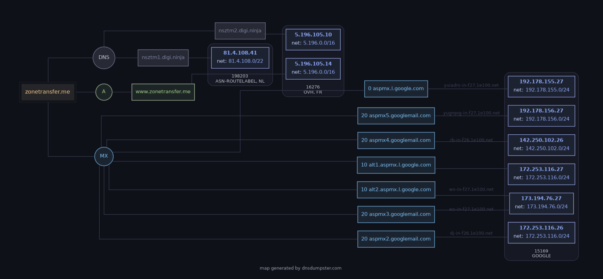

<html>
<body>
<div markdown="block" style="margin-top: 10px">
    
### Intro
DNS Recon屬於Passive Reconnaissance中的一環，本篇會依序介紹DNS Recon存在的必要性和做DNS Recon所會用到的工具；以及通過DNS Recon所獲得的網路拓撲結構後所能做的事情及相關工具:
- dig/nslookup
- fierce
- dnsrecon
- dnsenum
- Sublist3r
- dnsdumpster
  
  
### Process of a DNS request
下面簡單介紹DNS請求後會發生的流程，內容引自[TryHackMe-DNS in Detail](https://tryhackme.com/room/dnsindetail)，有興趣的可以去學習:

1. 首先當DNS請求發生後，會先查詢本機的快取，如果有匹配則直接請求IP
2. 若是本機快取沒有，則將請求傳送到Recursive DNS Server；通常來說這個DNS Server是由電信業者設置。同樣，先在這個Recursive DNS Server查詢快取，若有則返回，否則傳送請求到Root Server
3. 接下來就是DNS真正請求的流程，首先通過Root Server查詢到頂級域名(TLD)所對應的DNS Server，查詢到對應的TLD Server後將請求傳送給它。題外話，TLD有兩種類型：gTLD(generic TLD)和ccTLD(country-code TLD)。gTLD例如.com、.org、.edu；ccTLD例如.tw、.us。
4. TLD Server接收到後，再繼續對子域名進行查詢，例如在.com TLD Server中查詢.example.com在哪裡，查詢到後再將請求傳送給它
5. 最後傳送給的DNS Server就叫Authoritative Server，表示在這個DNS Server中能實際查詢到這個域名最終對應的實際IP，並由Authoritative Server返回這個實際IP給本機
6. 另外，在返回的途中，會在每一個Recursive Server儲存DNS快取並對每一條快取設置一個TTL(Time-to-Live)，規定在設置時間後這條快取就會失效，能大幅縮短用戶的查詢時間
  
  
### Tools
#### - dig/nslookup
這兩個工具都是做最初步的DNS偵查，目前`nslookup`已被官方淘汰，BIND只推薦使用`dig`
- `nslookup`: ***nslookup [OPTIONS] [DOMAIN_NAME] [DNS_SERVER]***

```bash
┌──(kali㉿kali)-[~]
└─$ nslookup -type=MX zonetransfer.me        
Server:         192.168.228.2
Address:        192.168.228.2#53

Non-authoritative answer:
zonetransfer.me mail exchanger = 0 ASPMX.L.GOOGLE.COM.
zonetransfer.me mail exchanger = 10 ALT2.ASPMX.L.GOOGLE.COM.
zonetransfer.me mail exchanger = 20 ASPMX4.GOOGLEMAIL.COM.
zonetransfer.me mail exchanger = 10 ALT1.ASPMX.L.GOOGLE.COM.
zonetransfer.me mail exchanger = 20 ASPMX5.GOOGLEMAIL.COM.
zonetransfer.me mail exchanger = 20 ASPMX2.GOOGLEMAIL.COM.
zonetransfer.me mail exchanger = 20 ASPMX3.GOOGLEMAIL.COM.
```
  

- `dig`: ***dig -t [RECORD_TYPE] [DOMAIN_NAME] @[DNS_SERVER]***

```bash
┌──(kali㉿kali)-[~]
└─$ dig -t any zonetransfer.me @101.101.101.101

; <<>> DiG 9.20.4-4-Debian <<>> -t any zonetransfer.me @101.101.101.101
;; global options: +cmd
;; Got answer:
;; ->>HEADER<<- opcode: QUERY, status: NOERROR, id: 59536
;; flags: qr rd ra; QUERY: 1, ANSWER: 13, AUTHORITY: 0, ADDITIONAL: 1

;; OPT PSEUDOSECTION:
; EDNS: version: 0, flags:; udp: 1232
; COOKIE: 7414480ab354ba0a01000000684683f03ab73e0d7251209c (good)
;; QUESTION SECTION:
;zonetransfer.me.               IN      ANY

;; ANSWER SECTION:
zonetransfer.me.        7200    IN      SOA     nsztm1.digi.ninja. robin.digi.ninja. 2019100801 172800 900 1209600 3600
zonetransfer.me.        7200    IN      A       5.196.105.14
zonetransfer.me.        7200    IN      MX      20 ASPMX2.GOOGLEMAIL.COM.
zonetransfer.me.        7200    IN      MX      10 ALT1.ASPMX.L.GOOGLE.COM.
zonetransfer.me.        7200    IN      MX      20 ASPMX4.GOOGLEMAIL.COM.
zonetransfer.me.        7200    IN      MX      10 ALT2.ASPMX.L.GOOGLE.COM.
zonetransfer.me.        7200    IN      MX      20 ASPMX3.GOOGLEMAIL.COM.
zonetransfer.me.        7200    IN      MX      20 ASPMX5.GOOGLEMAIL.COM.
zonetransfer.me.        7200    IN      MX      0 ASPMX.L.GOOGLE.COM.
zonetransfer.me.        301     IN      TXT     "google-site-verification=tyP28J7JAUHA9fw2sHXMgcCC0I6XBmmoVi04VlMewxA"
zonetransfer.me.        3599    IN      NS      nsztm2.digi.ninja.
zonetransfer.me.        3599    IN      NS      nsztm1.digi.ninja.
zonetransfer.me.        300     IN      HINFO   "Casio fx-700G" "Windows XP"
```
  

- `dig`: 做zone transfer: ***dig -t axfr [DOMAIN_NAME] @[NAME_SERVER]***

```bash
┌──(kali㉿kali)-[~]
└─$ dig -t axfr zonetransfer.me @nsztm1.digi.ninja

; <<>> DiG 9.20.4-4-Debian <<>> -t axfr zonetransfer.me @nsztm1.digi.ninja
;; global options: +cmd
zonetransfer.me.        7200    IN      SOA     nsztm1.digi.ninja. robin.digi.ninja. 2019100801 172800 900 1209600 3600
zonetransfer.me.        301     IN      TXT     "google-site-verification=tyP28J7JAUHA9fw2sHXMgcCC0I6XBmmoVi04VlMewxA"
zonetransfer.me.        7200    IN      MX      0 ASPMX.L.GOOGLE.COM.
zonetransfer.me.        7200    IN      MX      10 ALT1.ASPMX.L.GOOGLE.COM.
zonetransfer.me.        7200    IN      MX      10 ALT2.ASPMX.L.GOOGLE.COM.
zonetransfer.me.        7200    IN      MX      20 ASPMX2.GOOGLEMAIL.COM.
zonetransfer.me.        7200    IN      MX      20 ASPMX3.GOOGLEMAIL.COM.
zonetransfer.me.        7200    IN      MX      20 ASPMX4.GOOGLEMAIL.COM.
zonetransfer.me.        7200    IN      MX      20 ASPMX5.GOOGLEMAIL.COM.
zonetransfer.me.        7200    IN      A       5.196.105.14
zonetransfer.me.        7200    IN      NS      nsztm1.digi.ninja.
zonetransfer.me.        7200    IN      NS      nsztm2.digi.ninja.
zonetransfer.me.        300     IN      HINFO   "Casio fx-700G" "Windows XP"
_acme-challenge.zonetransfer.me. 301 IN TXT     "6Oa05hbUJ9xSsvYy7pApQvwCUSSGgxvrbdizjePEsZI"
_sip._tcp.zonetransfer.me. 14000 IN     SRV     0 0 5060 www.zonetransfer.me.
14.105.196.5.IN-ADDR.ARPA.zonetransfer.me. 7200 IN PTR www.zonetransfer.me.
asfdbauthdns.zonetransfer.me. 7900 IN   AFSDB   1 asfdbbox.zonetransfer.me.
asfdbbox.zonetransfer.me. 7200  IN      A       127.0.0.1
asfdbvolume.zonetransfer.me. 7800 IN    AFSDB   1 asfdbbox.zonetransfer.me.
canberra-office.zonetransfer.me. 7200 IN A      202.14.81.230
cmdexec.zonetransfer.me. 300    IN      TXT     "; ls"
...
```
  
  
#### - fierce
與前面所提的`dig`和`nslookup`不同，`fierce`有支援不連續的IP空間下的域名查詢，即它不是基於IP下去搜索的而已，而是有包含透過字典/brute-force枚舉嘗試得到子網域(*fierce - DNS scanner that helps locate non-contiguous IP space and hostnames against specified domains*)
- `fierce`: ***fierce --domain [DOMAIN_NAME]***

```bash
┌──(kali㉿kali)-[~]
└─$ fierce --domain zonetransfer.me
NS: nsztm2.digi.ninja. nsztm1.digi.ninja.
SOA: nsztm1.digi.ninja. (81.4.108.41)
Zone: success
{<DNS name @>: '@ 7200 IN SOA nsztm1.digi.ninja. robin.digi.ninja. 2019100801 '
               '172800 900 1209600 3600\n'
               '@ 301 IN TXT '
               '"google-site-verification=tyP28J7JAUHA9fw2sHXMgcCC0I6XBmmoVi04VlMewxA"\n'
               '@ 7200 IN MX 0 ASPMX.L.GOOGLE.COM.\n'
               '@ 7200 IN MX 10 ALT1.ASPMX.L.GOOGLE.COM.\n'
               '@ 7200 IN MX 10 ALT2.ASPMX.L.GOOGLE.COM.\n'
               '@ 7200 IN MX 20 ASPMX2.GOOGLEMAIL.COM.\n'
               '@ 7200 IN MX 20 ASPMX3.GOOGLEMAIL.COM.\n'
               '@ 7200 IN MX 20 ASPMX4.GOOGLEMAIL.COM.\n'
               '@ 7200 IN MX 20 ASPMX5.GOOGLEMAIL.COM.\n'
               '@ 7200 IN A 5.196.105.14\n'
               '@ 7200 IN NS nsztm1.digi.ninja.\n'
               '@ 7200 IN NS nsztm2.digi.ninja.\n'
               '@ 300 IN HINFO "Casio fx-700G" "Windows XP"',
 <DNS name _acme-challenge>: '_acme-challenge 301 IN TXT '
                             '"6Oa05hbUJ9xSsvYy7pApQvwCUSSGgxvrbdizjePEsZI"',
 <DNS name _sip._tcp>: '_sip._tcp 14000 IN SRV 0 0 5060 www',
 <DNS name 14.105.196.5.IN-ADDR.ARPA>: '14.105.196.5.IN-ADDR.ARPA 7200 IN PTR '
                                       'www',
 <DNS name asfdbauthdns>: 'asfdbauthdns 7900 IN AFSDB 1 asfdbbox',
...
```  

- `fierce`: 若是想要使用自定義字典檔，***fierce --domain [DOMAIN_NAME] --subdomain-file [PATH_TO_WORDLIST]***

```bash
┌──(kali㉿kali)-[~]
└─$ fierce --domain zonetransfer.me --subdomain-file wordlist.txt 
NS: nsztm2.digi.ninja. nsztm1.digi.ninja.
SOA: nsztm1.digi.ninja. (81.4.108.41)
Zone: success
{<DNS name @>: '@ 7200 IN SOA nsztm1.digi.ninja. robin.digi.ninja. 2019100801 '
               '172800 900 1209600 3600\n'
               '@ 301 IN TXT '
               '"google-site-verification=tyP28J7JAUHA9fw2sHXMgcCC0I6XBmmoVi04VlMewxA"\n'
               '@ 7200 IN MX 0 ASPMX.L.GOOGLE.COM.\n'
               '@ 7200 IN MX 10 ALT1.ASPMX.L.GOOGLE.COM.\n'
               '@ 7200 IN MX 10 ALT2.ASPMX.L.GOOGLE.COM.\n'
               '@ 7200 IN MX 20 ASPMX2.GOOGLEMAIL.COM.\n'
               '@ 7200 IN MX 20 ASPMX3.GOOGLEMAIL.COM.\n'
               '@ 7200 IN MX 20 ASPMX4.GOOGLEMAIL.COM.\n'
               '@ 7200 IN MX 20 ASPMX5.GOOGLEMAIL.COM.\n'
               '@ 7200 IN A 5.196.105.14\n'
               '@ 7200 IN NS nsztm1.digi.ninja.\n'
               '@ 7200 IN NS nsztm2.digi.ninja.\n'
               '@ 300 IN HINFO "Casio fx-700G" "Windows XP"',
 <DNS name _acme-challenge>: '_acme-challenge 301 IN TXT '
                             '"6Oa05hbUJ9xSsvYy7pApQvwCUSSGgxvrbdizjePEsZI"',
...
```
  
  
#### - dnsenum/dnsrecon
兩款都是強大的DNS偵查工具，在大部分情況下都能混搭使用，但目前而言`dnsenum`已較少人維護且擴展不易(基於Perl)，因此相較於`dnsenum`我會選擇`dnsrecon`(基於Python)來做使用
- `dnsrecon`: ***dns -d [DOMAIN_NAME] -n [DNS_SERVER]***

```bash
┌──(kali㉿kali)-[~]
└─$ dnsrecon -d zonetransfer.me -n 8.8.8.8                       
[*] std: Performing General Enumeration against: zonetransfer.me...
[-] DNSSEC is not configured for zonetransfer.me
[*]      SOA nsztm1.digi.ninja 81.4.108.41
[*]      NS nsztm1.digi.ninja 81.4.108.41
[*]      Bind Version for 81.4.108.41 secret"
[*]      NS nsztm2.digi.ninja 5.196.105.10
[*]      Bind Version for 5.196.105.10 secret"
[*]      MX ALT1.ASPMX.L.GOOGLE.COM 142.250.101.26
[*]      MX ASPMX4.GOOGLEMAIL.COM 142.251.190.27
[*]      MX ASPMX.L.GOOGLE.COM 108.177.97.26
[*]      MX ALT2.ASPMX.L.GOOGLE.COM 173.194.208.27
[*]      MX ASPMX5.GOOGLEMAIL.COM 192.178.212.26
[*]      MX ASPMX2.GOOGLEMAIL.COM 142.250.101.26
[*]      MX ASPMX3.GOOGLEMAIL.COM 173.194.208.27
[*]      MX ALT1.ASPMX.L.GOOGLE.COM 2607:f8b0:4023:c06::1a
[*]      MX ASPMX4.GOOGLEMAIL.COM 2607:f8b0:4003:c0a::1b
[*]      MX ASPMX.L.GOOGLE.COM 2404:6800:4008:c05::1b
[*]      MX ALT2.ASPMX.L.GOOGLE.COM 2607:f8b0:4023:100d::1b
[*]      MX ASPMX5.GOOGLEMAIL.COM 2607:f8b0:4001:c74::1b
[*]      MX ASPMX2.GOOGLEMAIL.COM 2607:f8b0:4023:c06::1a
[*]      MX ASPMX3.GOOGLEMAIL.COM 2607:f8b0:4023:100d::1b
[*]      A zonetransfer.me 5.196.105.14
[*]      TXT zonetransfer.me google-site-verification=tyP28J7JAUHA9fw2sHXMgcCC0I6XBmmoVi04VlMewxA
[*] Enumerating SRV Records
[+]      SRV _sip._tcp.zonetransfer.me www.zonetransfer.me 5.196.105.14 5060
[+] 1 Records Found
```
  
  
#### - sublist3r
是一款用OSINT查詢子域名的工具，非常簡單直覺，但沒辦法用於查詢子域名以外的DNS紀錄
- `sublist3r`: ***sublist3r [OPTIONS] -d [DOMAIN_NAME]***

```bash
sublist3r -d zonetransfer.me
sublist3r -d zonetransfer.me -b     #sublist3r默認只使用OSINT查詢子域名,-b是搭配使用字典檔進行爆破
sublist3r -d zonetransfer.me -e google,yahoo    #指定搜索引擎
```
  
  
#### - dnsdumpster
是一個在線網站並分析很全面的DNS紀錄，包括DNS Records、DNS Server的地理分佈和提供一個完整的網路拓撲，非常實用

  

### Reason
那麼介紹這麼多，DNS偵查後的結果能拿來做什麼呢？首先最重要的，能看出整個組織/公司的網路拓撲架構，並可針對各個服務器去設計不同的攻擊方式。同時還可以枚舉出子域名去做不同攻擊角度的攻擊，並搭配Nmap去做後續的端口/服務/版本檢測來確認攻擊表面。所以總結來說，屬於Passive Reconnaissance的DNS Recon是滲透測試中不可或缺的一環


## 學習資料
1. [TryHackMe-DNS in Detail](https://tryhackme.com/room/dnsindetail)
2. [TryHackMe-DNS Manipulation](https://tryhackme.com/room/dnsmanipulation)
3. [Day5 被動情蒐(2)-dig、fierce、DNSenum、DNSrecon、Sublist3r、dnsdumpster](https://ithelp.ithome.com.tw/m/articles/10268608)
4. [dnsdumpster](https://dnsdumpster.com/) 

</div>
</body>
</html>
